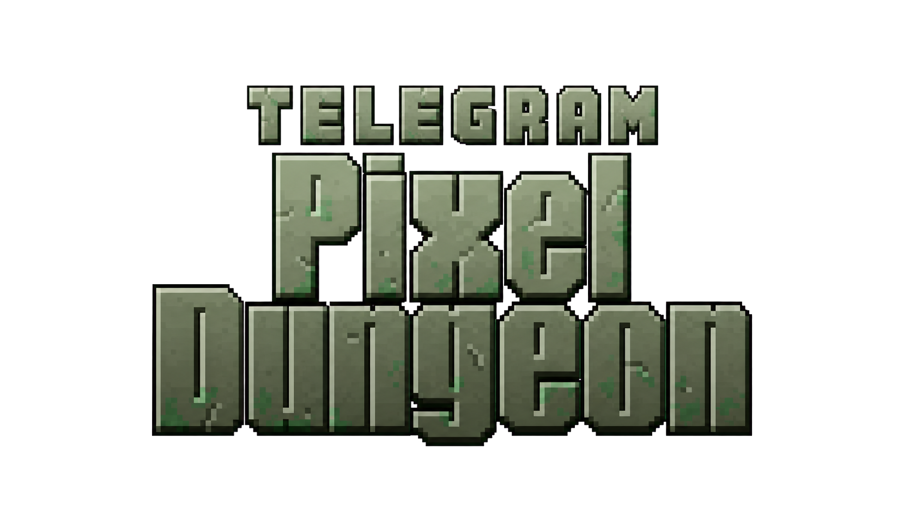

<p align="center">
  
</p>

<h1 align="center">Telegram Pixel Dungeon</h1>

<p align="center">
  Классический пошаговый roguelike, бережно адаптированный для Telegram Mini Apps.<br>
  <sub>Classic turn-based roguelike, carefully adapted for Telegram Mini Apps.</sub>
</p>

<p align="center">
  <a href="https://t.me/pixel_dungeon_gamebot/pixel_dungeon">
    
  </a>
</p>

<p align="center">
  <a href="https://github.com/shiba-vibecoding/pixel-dungeon-telegram/actions/workflows/deploy-pages.yml"></a>
  <a href="LICENSE"></a>
  
  
</p>

---

## Русский

### Об игре

Это открытый Telegram- и веб-порт оригинальной **Pixel Dungeon 1.9.2a** от
[Watabou](https://github.com/watabou/pixel-dungeon), основанный на libGDX/GWT-порте
[gnojus](https://github.com/gnojus/pixel-dungeon-gdx) и Arcnor.

Внутри сохранена атмосфера оригинала: процедурно создаваемое подземелье,
пошаговые сражения, четыре героя, случайные предметы, ловушки, боссы,
испытания и необратимые последствия каждого решения.

### Играть

Откройте [Telegram Pixel Dungeon](https://t.me/pixel_dungeon_gamebot/pixel_dungeon) в Telegram
и запустите мини-приложение. Игра не требует установки отдельного приложения.

### Особенности Telegram Pixel Dungeon

- **Адаптация под телефон.** Полноэкранный режим, безопасные отступы для вырезов
  экрана и элементов Telegram, восстановление прерванных касаний и защита от
  случайного закрытия активного забега.
- **15 языков.** Язык выбирается в настройках игры, а специальные пиксельные
  шрифты включают необходимые символы для всех поддерживаемых локалей.
- **Бережный Vanilla+.** Загрузочные подсказки знакомят со скрытыми приёмами
  управления, осмотр врага показывает его точные боевые характеристики, а
  эффекты семян можно мгновенно активировать прямо из рюкзака. Числовые
  параметры предметов, генератор уровней и таблицы добычи оригинала при этом
  не изменены.
- **Персональные сохранения.** Прогресс и настройки разделяются по Telegram ID
  на устройстве. На поддерживаемых клиентах они дополнительно синхронизируются
  через Telegram CloudStorage; новая облачная копия становится активной только
  после полной загрузки, поэтому оборванная сеть не затирает рабочий снимок.
- **Работа без собственного сервера.** Клиент собирается в статический сайт и
  бесплатно публикуется через GitHub Pages.
- **Оригинальный игровой процесс.** Порт не превращает Pixel Dungeon в
  pay-to-win: в игре нет рекламы, аналитики и платежей.
- **Телефон и компьютер.** Поддерживаются сенсорное управление, мышь,
  клавиатура и переназначение клавиш.

### Языки

| | | |
|---|---|---|
| English | Русский | Español |
| Français | Deutsch | Português (Brasil) |
| Polski | Italiano | Türkçe |
| Українська | Bahasa Indonesia | 日本語 |
| 한국어 | 简体中文 | 繁體中文 |

Все локали используют единый UTF-8-каталог. Проверка в CI обнаруживает
пропущенные строки, повреждённые плейсхолдеры, дубликаты и отсутствующие в
шрифте символы. Подробнее: [LOCALIZATION.md](LOCALIZATION.md).

### Сохранения и приватность

Сохранение выполняется локально после игровых изменений. В Telegram локальная
копия привязана к текущему пользователю, а при наличии CloudStorage зеркалируется
в облако Telegram и может быть восстановлена на другом устройстве.

Не рекомендуется одновременно продолжать один забег на двух устройствах:
Telegram CloudStorage использует принцип «последняя синхронизированная версия
побеждает». При запуске обычной веб-версии вне Telegram доступна только локальная
копия браузера.

Проект не содержит собственной аналитики, рекламы, платежей или сервера
с пользовательскими данными. Полное описание: [PRIVACY.md](PRIVACY.md).

### Управление

На телефоне:

- коснитесь клетки или объекта, чтобы двигаться и взаимодействовать;
- перетаскивайте карту одним пальцем;
- изменяйте масштаб жестом двумя пальцами;
- используйте нижнюю панель для поиска, ожидания, осмотра, рюкзака и быстрых
  предметов.

На компьютере доступны мышь и клавиатура. Основные стандартные клавиши:

| Действие | Клавиши |
|---|---|
| Движение | стрелки или цифровой блок |
| Ожидание | `Space` |
| Поиск | `S` |
| Рюкзак | `I` |
| Быстрый предмет | `Q` |
| Осмотр клетки | `V` |
| Герой / каталог / журнал | `H` / `C` / `J` |
| Масштаб | `+` / `-` / `/` |

### Локальная разработка

Нужны **JDK 8**, **Node.js** и **Python 3** для проверки локализаций. В Windows
используйте `gradlew.bat` вместо `./gradlew`.

```bash
# Запустить desktop-версию
./gradlew desktop:run

# Проверить локализации и Telegram-обвязку
python tools/validate_localization.py
node --test telegram/test-*.mjs
node --test telegram-worker/test/*.mjs

# Собрать готовое Telegram Mini App
./gradlew --no-daemon html:dist
node telegram/build-telegram.mjs html/build/dist dist-telegram

# Открыть production-сборку локально
node telegram/serve.mjs dist-telegram 8080
```

После этого откройте `http://127.0.0.1:8080/`. Для тестирования настоящего
Telegram CloudStorage запускайте опубликованную HTTPS-версию через бота.

### Публикация

Workflow [`.github/workflows/deploy-pages.yml`](.github/workflows/deploy-pages.yml)
проверяет переводы и Telegram-обвязку, собирает GWT-клиент и публикует его в
GitHub Pages после push в `main` или `master`.

В настройках репозитория должен быть выбран источник:
**Settings → Pages → Source → GitHub Actions**.

Подробные инструкции:

- [публикация через GitHub Pages](DEPLOY-GITHUB.md);
- [устройство Telegram Mini App](TELEGRAM-MINIAPP.md);
- [автоответчик Telegram-бота](telegram-worker/README.md);
- [система локализации](LOCALIZATION.md).

### Структура проекта

| Путь | Назначение |
|---|---|
| `core/` | игровая логика и интерфейс Pixel Dungeon |
| `PD-classes/` | движок Noosa и общие классы |
| `android/assets/` | графика, звук, шрифты и каталоги локализации |
| `html/` | GWT/libGDX веб-бэкенд |
| `telegram/` | интеграция Mini Apps, сохранения и production-упаковка |
| `telegram-worker/` | безопасный webhook-автоответчик бота с кнопкой запуска игры |
| `tools/` | генерация и аудит переводов и шрифтов |
| `.github/workflows/` | автоматическая проверка, сборка и публикация |

---

## English

**Telegram Pixel Dungeon** is an open Telegram and web port of
[Watabou's Pixel Dungeon 1.9.2a](https://github.com/watabou/pixel-dungeon),
built on the libGDX/GWT port by
[gnojus](https://github.com/gnojus/pixel-dungeon-gdx) and Arcnor.

[Launch Telegram Pixel Dungeon](https://t.me/pixel_dungeon_gamebot/pixel_dungeon) — no separate
installation is required.

### Highlights

- classic turn-based Pixel Dungeon gameplay and atmosphere;
- careful Vanilla+ improvements: contextual loading tips, exact enemy stats on
  inspection, and immediate seed use without altering numeric item stats,
  level generation, or vanilla loot tables;
- mobile Telegram layout with fullscreen safe areas and touch recovery;
- 15 selectable languages with automated catalogue and font validation;
- local-first, per-Telegram-user saves with transactional Telegram CloudStorage
  snapshots that keep the previous save intact after interrupted uploads;
- touch, mouse and remappable keyboard controls;
- static GitHub Pages deployment with no custom backend;
- no analytics, advertising or payments.

### Build locally

JDK 8, Node.js and Python 3 are required. On Windows, use `gradlew.bat`.

```bash
python tools/validate_localization.py
node --test telegram/test-*.mjs
node --test telegram-worker/test/*.mjs
./gradlew --no-daemon html:dist
node telegram/build-telegram.mjs html/build/dist dist-telegram
node telegram/serve.mjs dist-telegram 8080
```

Open `http://127.0.0.1:8080/`. See [DEPLOY-GITHUB.md](DEPLOY-GITHUB.md),
[TELEGRAM-MINIAPP.md](TELEGRAM-MINIAPP.md) and
[LOCALIZATION.md](LOCALIZATION.md) for the full technical documentation.

---

## Credits and license

- **Original game, design and assets:** [Watabou](https://github.com/watabou/pixel-dungeon)
- **libGDX port:** Arcnor and [gnojus](https://github.com/gnojus/pixel-dungeon-gdx)
- **Community localization sources:** [Pixel Dungeon ML](https://github.com/rodriformiga/pixel-dungeon) and [Remixed Dungeon](https://github.com/NYRDS/remixed-dungeon)
- **Telegram port:** [@barboskich](https://t.me/barboskich)

The project is distributed under
[GNU General Public License v3.0 only](LICENSE). Please preserve the original
authors' attribution and keep the corresponding source code available when
redistributing modified builds.
